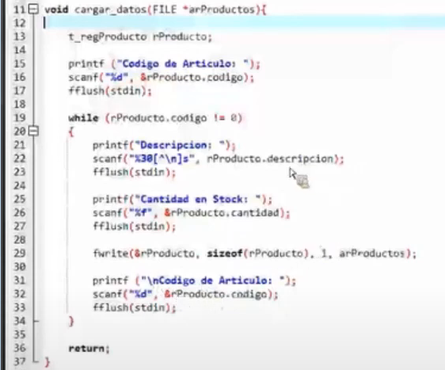
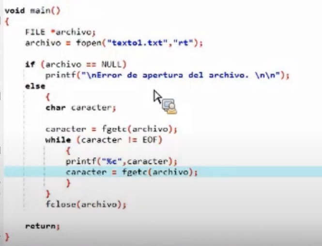
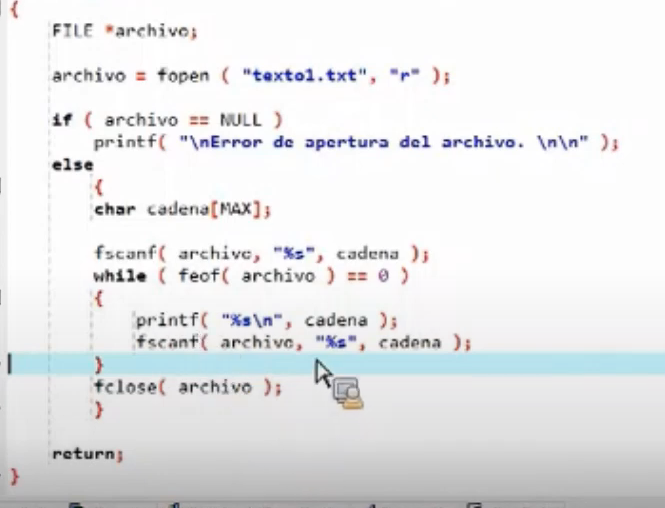

# Manejo de Archivos de Texto en C

## Conceptos Fundamentales

Los archivos de texto están compuestos exclusivamente por caracteres, donde cada byte corresponde a un carácter según la codificación utilizada (generalmente ASCII o UTF-8). Su principal característica es que son directamente legibles por humanos.

### Formatos comunes:

- **.txt**: Archivos de texto plano sin estructura definida
- **.csv**: Valores separados por comas (Comma-Separated Values)
    - Cada línea representa un registro
    - Campos separados por comas (u otros delimitadores)
    - Ampliamente usado para intercambio de datos

## Acceso Secuencial

El tratamiento de archivos de texto en C es siempre secuencial:

1. Se comienza desde el primer elemento
2. Solo se puede agregar al final
3. No se pueden modificar registros existentes directamente
4. Los elementos pueden leerse de tres formas:
    - Carácter por carácter
    - Bloques de bytes/caracteres
    - Línea completa

## Pasos para Trabajar con Archivos de Texto

5. Declaración del puntero FILE
```c
FILE *archivo;  // Variable para manejar el archiv
```
6. Apertura del archivo
```c
archivo = fopen("nombre_archivo", "modo");

```

### Modos de apertura principales:

| Modo | Descripción |
| --- | --- |
| "r" | Lectura (debe existir) |
| "w" | Escritura (crea o trunca) |
| "a" | Append (agrega al final) |
| "r+" | Lectura/escritura (debe existir) |
| "w+" | Lectura/escritura (crea o trunca) |
| "a+" | Lectura/append (escribe al final) |

### 3. Verificación de apertura

```c
if (archivo == NULL) {
    printf("Error al abrir el archivo\\n");
    exit(1);
}
```

## Funciones de Lectura

7.  fgetc - Lectura carácter por carácter

```c
int ch;
while ((ch = fgetc(archivo)) != EOF) {
    printf("%c", ch);  // Procesar cada carácter
}
```

8. fgets - Lectura línea por línea

```c
char linea[256];
while (fgets(linea, sizeof(linea), archivo) != NULL) {
    printf("%s", linea);  // Procesar cada línea
}
```

9. fscanf - Lectura con formato

```c
char nombre[50];
int edad;
while (fscanf(archivo, "%[^,],%d\\n", nombre, &edad) == 2) {
    printf("Nombre: %s, Edad: %d\\n", nombre, edad);
}
```

## Funciones de Escritura

10. **fputc** - Escritura carácter por carácter
```c
fputc('A', archivo);  // Escribe un carácter
```

11. **fputs** - Escritura de cadenas
```c
fputs("Hola Mundo\\n", archivo);  // Escribe una cadena
```

12. **fprintf** - Escritura con formato
El *fprintf *nos devuelvo un entero, correspondiente a la cantidad de caracteres guardados en el archivo
```c
fprintf(archivo, "%s,%d\\n", "Juan Perez", 30);  // Formato CSV
```


## Cierre del archivo

Es importante cerrar los archivos luego de hacer un manejo con ello para evitar problemas con la informacion que se esta almacenando en ellos, como perdida o etc.

```c
fclose(archivo);
```

## Ejemplo Completo: Procesamiento de CSV

```c
#include <stdio.h>
#include <stdlib.h>

int main() {
    FILE *entrada, *salida;
    char nombre[50];
    int edad;

    // Abrir archivos
    entrada = fopen("datos.csv", "r");
    salida = fopen("resultado.txt", "w");

    if (entrada == NULL || salida == NULL) {
        printf("Error al abrir archivos\\n");
        return 1;
    }

    // Leer CSV y procesar
    fprintf(salida, "Listado de personas:\\n");
    fprintf(salida, "--------------------\\n");

    while (fscanf(entrada, "%[^,],%d\\n", nombre, &edad) == 2) {
        fprintf(salida, "Nombre: %-20s Edad: %d\\n", nombre, edad);
    }

    // Cerrar archivos
    fclose(entrada);
    fclose(salida);

    printf("Procesamiento completado\\n");
    return 0;
}

```

## Buenas Prácticas

13. **Validar siempre** operaciones de archivo
14. **Usar buffers adecuados** para lectura línea por línea
15. **Preferir fprintf/fscanf** para formato estructurado
16. **Cerrar archivos** inmediatamente después de usarlos
17. **Manejar adecuadamente** los delimitadores en CSV
18. **Considerar codificación** de caracteres (ASCII/UTF-8)

## Ejemplo: Generador de CSV

```c
#include <stdio.h>

int main() {
    FILE *csv = fopen("empleados.csv", "w");

    if (csv == NULL) {
        printf("Error al crear archivo\\n");
        return 1;
    }

    // Encabezados
    fprintf(csv, "ID,Nombre,Departamento,Salario\\n");

    // Datos
    fprintf(csv, "1,Juan Perez,Ventas,45000\\n");
    fprintf(csv, "2,Maria Gomez,TI,52000\\n");
    fprintf(csv, "3,Carlos Ruiz,Contabilidad,48000\\n");

    fclose(csv);
    printf("Archivo CSV generado correctamente\\n");

    return 0;
}

```

Este código genera un archivo CSV estructurado que puede abrirse directamente en Excel u otras aplicaciones de hojas de cálculo.






