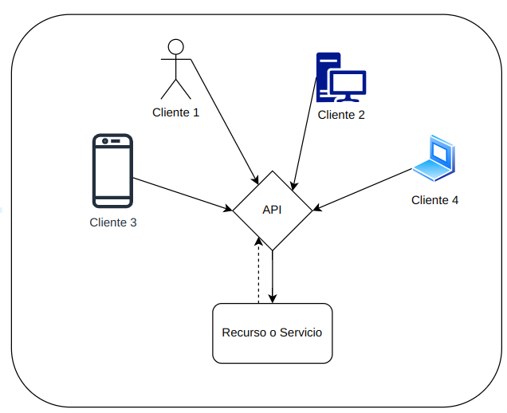

# Backend

## Que es el Backend?

El **back end (o backend)**, también conocido como desarrollo del lado del servidor, se refiere a la parte de un sitio web o aplicación web que no es visible para los usuarios. Se encarga de la lógica de la aplicación, el almacenamiento de datos y la comunicación con el servidor. Entre sus tareas se encuentran:

- Implementar la lógica de la aplicación.
- Almacenar y recuperar datos de una base de datos.
- Procesar solicitudes y enviar respuestas al usuario.
- Asegurar la seguridad del sitio web.

# API

## Que es una API?

Una **API o interfaz de programación de aplicaciones **es un conjunto de definiciones y protocolos que se usa para diseñar e integrar el software de las aplicaciones.

Las APIs permiten que sus productos y servicios se comuniquen con otros, sin necesidad de saber cómo están implementados.

En nuestro caso utilizaremos, una API para comunicar el front end de la aplicación con los datos almacenados en el back end (posteriormente veremos )

<!-- Column 1 -->

<!-- Column 2 -->

## Tipos de APIs

### Segun su Politica de Uso

**1. APIs públicas o abiertas: **Las APIs públicas también son conocidas como API abiertas y están disponibles para que otros usuarios o desarrolladores las empleen con mínimas restricciones o, en algunos casos incluso, están totalmente accesibles.

**2. APIs privadas o internas: **Las APIs privadas o internas están ocultas de los usuarios externos y se exponen únicamente para los sistemas internos de una organización. Se emplean para el desarrollo interno de la empresa, optimizando la productividad y la reutilización de servicios.

**3. APIs de aliados comerciales o Partners: **Las APIs de aliados comerciales son aquellas que se exponen entre los miembros de una alianza comercial. Como no están disponibles para todos, se necesita una autorización especial para usarlas.

**4. APIs compuestas: **Las APIs compuestas utilizan distintos datos o diversas APIs de servicio y permiten que los desarrolladores puedan acceder a varios terminales.

### Segun su Uso

**1. API de datos: **Las APIs de datos proporcionan a varios bancos de datos o proveedores SaaS (*Software as a Service* o Software como Servicio) acceso CRUD (*Create, Read, Update, Delete*) a conjuntos de datos, permitiendo la comunicación entre una aplicación y un sistema de gestión de bases de datos.

**2. API de sistemas operativos: **Este grupo de APIs definen cómo las aplicaciones usan los recursos disponibles y servicios del sistema operativo. Por lo que cada OS (*Operative System*) posee un conjunto de APIs.

**3. APIs remotas: **Este grupo define los estándares de interacción que las aplicaciones tienen en diferentes dispositivos, es decir, un software accede a ciertos recursos ubicados fuera del dispositivo que los solicita, como dice su nombre. Como dos aplicaciones se conectan de forma remota a través de una red, las APIs remotas usan protocolos para lograr la conexión.

**4. APIs web: **Esta clase de API es la más común, dado que las APIs web proporcionan datos que los dispositivos pueden leer y transferirlos entre sistemas basados en la web o arquitectura cliente-servidor

## Protocolos de APIs en Web

Los protocolos de API permiten estandarizar el intercambio de datos entre los diferentes servicios web. Esto brinda la oportunidad de acceder a capacidades en diversos sistemas, a través de diferentes lenguajes de programación y en distintos sistemas operativos.

- RCP - Remote Procedure Call
- SOAP - Service Object Access Protocol
- **REST - Representational State Transfer **(es el que mas vamos a ver)
- GraphQL

### **REST - Representational State Transfer**

***REST*** es una interfaz para conectar varios sistemas basados en el protocolo HTTP (uno de los protocolos más antiguos) y nos sirve para obtener y generar datos y operaciones, devolviendo esos datos en formatos muy específicos, como XML y JSON.  **Sus principios más importantes son:**

- Un **protocolo cliente/servidor sin estado**: cada mensaje HTTP contiene toda la información necesaria para comprender la petición. Como resultado, ni el cliente ni el servidor necesitan recordar ningún estado de las comunicaciones entre mensajes.
- Un **conjunto de operaciones** bien definidas que se aplican a todos los *recursos* de información. Ejemplos: **POST, GET, PUT y DELETE**.
- Una **sintaxis universal** para identificar los recursos. En un sistema REST, cada recurso es direccionable únicamente a través de su *URI*.
- El **uso de hipermedios** (links): es posible navegar de un recurso REST a muchos otros, simplemente siguiendo enlaces.

## **RESTful API o API REST**

Entonces una **RESTful API **es una API que sigue los **principios de REST**.

<!-- Column 1 -->

<!-- Column 2 -->
Los principios RESTful se basan en la idea de que los recursos se representan como objetos y que las operaciones sobre esos recursos se realizan utilizando métodos HTTP estándar. Esto hace que las APIs RESTful sean fáciles de consumir y desarrollar.

### **Partes principales de una REST API**

<!-- Column 1 -->
- **Request**
    - URI
    - Verbos HTTP
    - Headers
    - Request Body

<!-- Column 2 -->
- **Response**
    - Código de estado
    - Response Body
    - Response time

### **Request -  Petición al servidor**

Para realizar una petición necesitamos una serie de datos. El **objeto request** debe estar formado con una serie de elementos:

- Verbo o Método HTTP
- URI (Uniform Resource Identifier)
- Headers
- Objeto body (en caso de que corresponda)

### **URI / URL**

El **URI (uniform resource identifier)** o identificador uniforme de recursos (por su nombre en español) sirve para acceder a un recurso físico o abstracto por Internet. Dependiendo de la situación, el recurso puede ser de muchos tipos: por ejemplo, una página web o el remitente o al destinatario de un correo electrónico. También se lo conoce como **URL (uniform resource locator)**

**Partes que componen al URI:**

### **Verbos / métodos HTTP**

El protocolo HTTP define un conjunto de **métodos de petición** para indicar la acción que se desea realizar para un recurso determinado. Los verbos HTTP más comunes para realizar peticiones son:

| **GET** | Obtiene un recurso |
| --- | --- |
| **POST** | Crear un nuevo recurso |
| **PUT** | Modifica los datos |
| **DELETE** | Elimina un recurso |
| **PATCH** | Modifica un recurso en particular |

### **Headers - Encabezados**

Las cabeceras (en inglés headers) HTTP permiten al cliente y al servidor enviar **información adicional** junto a una petición o respuesta.

Algunos de los encabezados HTTP más comunes incluyen:

- **Host**: Especifica el nombre del host al que se envía la solicitud.
- **User-Agent**: Identifica el navegador o el cliente que envía la solicitud.
- **Accept**: Especifica el tipo de contenido que el cliente puede aceptar.
- **Content-Type**: Especifica el tipo de contenido de la respuesta.
- **Content-Length**: Especifica la longitud de la respuesta.
- **Authorization**: Proporciona información de autenticación para la solicitud.
- **Cache-Control**: Controla cómo se almacena en caché la respuesta.

### **Response - Respuesta del servidor**

El **objeto response** se utiliza para especificar el código de estado de la respuesta, los encabezados y el cuerpo de la respuesta.

El **response time **es el tiempo en que el servidor tarda en responder a un request. Este tiempo en ocasiones es vital y por lo tanto debe optimizarse el código (brindar un SLA). En nuestro caso esto no es necesario.

# **Códigos de estado HTTP**

El **código de estado** **(status code) **de la respuesta es un número que indica el resultado de la solicitud. 

<!-- Column 1 -->
| **Code** | **Significado** |
| --- | --- |
| 1xx | Informativas |
| 2xx | Correctas |
| 3xx | Redirecciones |
| 4xx | Errores del cliente |
| 5xx | Errores del servidor |

<!-- Column 2 -->
*Ejemplos:*

| **Code** | **Significado** |
| --- | --- |
| 200 | OK |
| 201 | Created |
| 400 | Bad Request |
| 401 | Authorization Required |
| 403 | Forbidden |
| 404 | Not Found |
| 500 | Internal Server Error |
| 504 | Service Temporarily Unavailable |

# Integracion entre Front y Back

## Como vamos a trabajar nosotros las API

Vamos a tener un front que se va a comunicar con la API, la cual se va a comunicar con el back y va a retornar la informacion.

El usuario o “Actor” no va a tener acceso al back de manera directa.

