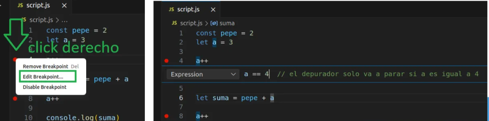

# Que es un Bug?

- Un bug es un error de código en un programa informático
    - Podemos decir que un bug es cualquier comportamiento error o fallo de un programa
- Podemos dividir los bugs en categorías:
    - De sintaxis
    - De ejecución
    - De diseño y/o lógica.

## Origen del Termino

# ¿Qué es Depurar o Debuggear?

- Es el proceso que consiste en la detección y corrección de bugs.
    - En inglés se dice “debugging” y en la mayoría de los ambientes van conocerlo de esta forma
- Es un proceso más que habitual en el ambiente del desarrollo tanto en la etapa de creación como en la de mantenimiento de un programa.

# ¿Qué es un Debugger o Depurador?

- Es una herramienta que se utiliza para el proceso de debugging.
- Existes muchos debuggers pero casi todos ofrecen las mismas posibilidades.
- Uno de los debuggers más famosos o que más van a escuchar es GDB, pero existen otros, como por ejemplo el debugger de JavaScript de Node.js

## ¿Qué puede hacer un Debugger?

- Puede detener la ejecución del programa e irlo ejecutando linea a linea. Hasta puede ejecutarlo instrucción a instrucción.
- Brinda información sobre variables, scopes, threads, stack trace y de casi todo lo que compone al programa en sí.

## **El “debugger” más primitivo**

- Una forma instintiva de hacer debugging es usar “prints” en partes específicas del código.
- Un gran poder conlleva una gran responsabilidad. Usen prints como último recurso…

# **Depurando JavaScript**

## Instalación de Node.js (Ubuntu)

Ejecutar estos comandos uno por uno:

```bash
`sudo apt update`

**`sudo apt upgrade -y      —------->   OJO: tarda mucho`**

`sudo apt install curl -y`

`curl -o- https://raw.githubusercontent.com/nvm-sh/nvm/v0.39.0/install.sh | bash`

`source ~/.bashrc`

`nvm install --lts`

`nvm alias default 20.17.0`

`node -v npm -v`
```

## **Iniciando el debugger en VSCode**

**Paso 0: **Instalar Node.js

**Paso 1: **Abrir la carpeta del proyecto en VSCode que tenga el archivo .js a depurar

**Paso 2:** Ir a la pestaña **run and debug **(el play con el bichito)

**Paso 3: **hacer click donde dice “Crear un archivo launch.json” y elegir en el menú la opción “Node.js”

**Paso 4: **Hacer click arriba a la izquierda en **Launch program**


## **Breakpoint**

Un breakpoint o punto de parada sirve para que al debuggear el debugger detenga la ejecución en la línea donde colocamos el breakpoint.

### Breakpoint condicional

Es un breakpoint que tiene asociada una condición. El programa se detendrá en esa línea si y sólo si se cumple la condición asociada.



### **Comandos: Continue**

Este comando permite continuar con la ejecución hasta el siguiente breakpoint o hasta el fin del programa.

### **Comandos: Next**

Permite avanzar a la línea inmediatamente siguiente o si existe algún breakpoint intermedio, se detiene en el.

### Comandos: Step into

- Permite ingresar dentro del código de una función para depurar allí
- Si en el flujo de ejecución existe un breakpoint se detendrá en el

### Comandos: Step Out

- Sale de la función actual hacia la función que la llamó.
- Si en el flujo de ejecución existe un breakpoint se detendrá en el

### **Información de variables**

Permite observar el contenido en ese instante de ejecución de las variables.

También se le puede dar “seguimiento” (**watch**) a una variable y cada vez que es usada podemos hacer que el programa se detenga

### Seteo de variables

Permite cambiar el valor de las variables en tiempo de ejecución pudiendo así llegar a casos bordes o permitiendo hacer análisis del comportamiento del programa en ese contexto.

### **Stack trace**

- Muestra la pila de ejecución del programa en ese momento. Nos permite observar en qué función estamos, quién y dónde se llamo a esa función.
- Un stack trace es un informe de los elementos activos en la pila de ejecución en un momento determinado durante la ejecución de un programa.
