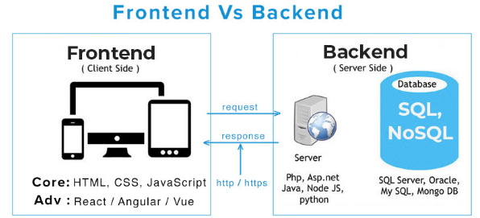
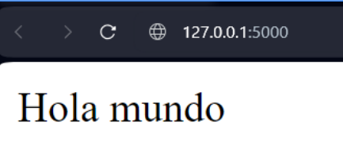
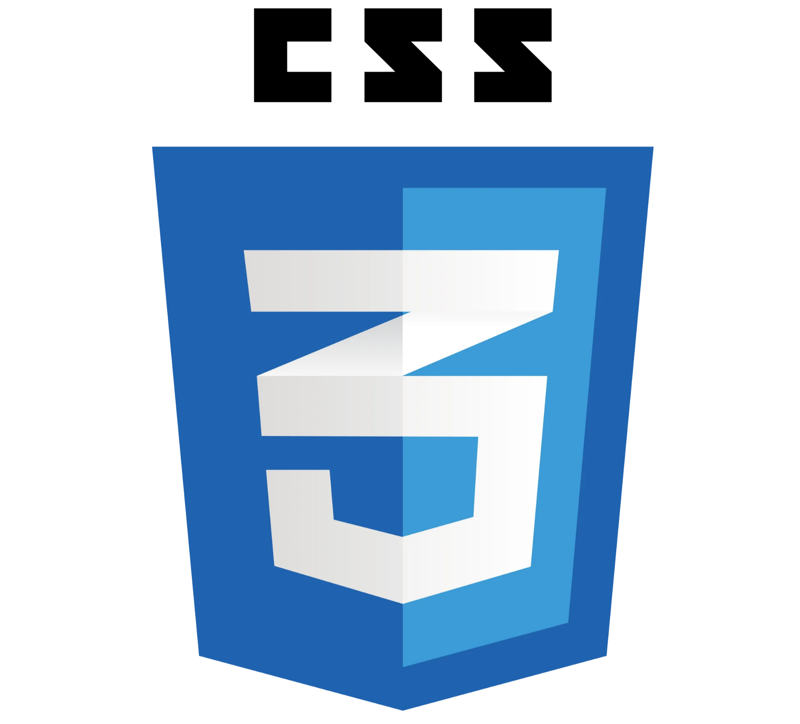

# Introducción al Desarrollo Web

## Desarrollo Web

El desarrollo web es el **proceso de crear y mantener, sitios y aplicaciones web**. Abarca una amplia gama de tareas, desde el diseño y la planificación hasta la codificación y la implementación. El desarrollo Web se suele separar entre **Front end **y **Back End**.



## Introducción al Back-end

### ¿Que es el Back-end?

El **back end (o back-end)**, también conocido como <u>desarrollo del lado del servidor</u>, se refiere a la parte de un sitio web o aplicación web que no es visible para los usuarios. Se encarga de la lógica de la aplicación, el almacenamiento de datos y la comunicación con el servidor. Entre sus tareas se encuentran:

### Frameworks de Back-end

Existen muchas herramientas para armar el back end de una aplicación o sitio web, dependiendo de la tecnología que se esté utilizando.

<!-- Column 1 -->


<!-- Column 2 -->


<!-- Column 3 -->


<!-- Column 4 -->


<!-- Column 5 -->


<!-- Column 6 -->


### FLASK

*Flask* es un **framework web **para **Python**. Es minimalista y se enfoca en proporcionar las herramientas básicas para construir aplicaciones web. En lugar de incluir funcionalidades predefinidas como manejo de base de datos o validación de formularios, Flask permite a los desarrolladores elegir las librerías y herramientas adicionales que necesite para su proyecto.

Más adelante veremos cómo utilizar de manera básica ciertas funcionalidades de Flask y en las siguientes clases profundizaremos sobre aspectos del desarrollo back end.

<!-- Column 1 -->
*Ejemplo:*

<!-- Column 2 -->

```python
@app.route('/') # Indica la ruta de la pagina (en este caso es la ruta de la raiz)
def index():
    return "Hola mundo"
```




## Introduccion al Front End

### ¿Que es el Front End?

El **front end (o frontend)**, también conocido como <u>desarrollo del lado del cliente</u>, se refiere a la parte de un sitio web o aplicación web con la que los usuarios interactúan directamente. Es la cara visible del sitio, y se encarga de la **interfaz de usuario (UI) **y la **experiencia del usuario (UX)**. Entre sus tareas se encuentran:

### Lenguajes de Front End

Para el desarrollo del front end de una aplicación se suele utilizar un **stack **básico de desarrollo, y éste cuenta de las siguientes 3 tecnologías:

<!-- Column 1 -->


<!-- Column 2 -->


<!-- Column 3 -->


### HTML

*HTML (HyperText Markup Language) *es un **lenguaje de marcado **que define la estructura del contenido de una página Web. Este lenguaje consiste en una serie de elementos que usarás para encerrar diferentes partes del contenido para que se vean o comporten de una determinada manera.

***Importante:*** **HTML no es un lenguaje de programación **Es un lenguaje de marcado. Sirve para indicar una estructura de elementos, no para dar instrucciones a la máquina.

*Ejemplo:*

### CSS

*CSS* *(Cascading Style Sheets) *u *Hojas de estilo en cascada *es un **lenguaje de hojas de estilo**, es decir, te permite aplicar estilos de manera selectiva a elementos en documentos HTML.

***Importante:*** **CSS no es un lenguaje de programación. Tampoco de marcado.** Es un lenguaje de hojas de estilo. Sirve para dar estilo a elementos que ya fueron previamente indicados y ubicados en una estructura HTML. Otros ejemplos de lenguajes de estilo son XSL y Sass.

### Javascript

*JavaScript* es un **lenguaje de programación** que se utiliza para añadir interactividad a las páginas web. Permite crear animaciones, juegos, formularios dinámicos y mucho más. Es uno de los lenguajes de programación más populares del mundo y se utiliza en millones de sitios web.

*Ejemplo de codigo:*

```javascript
const title = document.getElementById("titulo")

title.addEventListener("mouseover", () => {
    alert("Hola")
})

const changeColor = document.getElementById("change-color")

changeColor.onclick = function (event) {
    const R = randomNumber().toString()
    const G = randomNumber().toString()
    const B = randomNumber().toString()
    title.style.color = `rgb(${R},${G},${B})`
}

function randomNumber() {
    return (Math.random() * 256).toFixed(0)
}
```

Más adelante explicaremos qué está ocurriendo en este script, no hace falta que lo entiendan ahora.

<!-- Column 1 -->
**Tipos de Datos:**

<!-- Column 2 -->
**Operaciones:**

<!-- Column 1 -->
| Number | Representa un número, no lleva comillas. |
| --- | --- |
| String | Cadena de texto, debe ir entre comillas. |
| Boolean | Tienen valor verdadero/falso (true/false). No llevan comillas |
| Array | Estructura que permite almacenar varios valores en una sola referencia |
| Object | Básicamente cualquier cosa. Todo en javascript es un objeto. |

<!-- Column 2 -->
| Suma/ Concatenación | Suma dos números, o junta dos cadenas en una | + |
| --- | --- | --- |
| Resta, multiplicación, división | Mismo resultado matemático | -, *, / |
| Asignación | Asigna un valor a una variable | = |
| Identidad/ Igualdad | Comprueba si dos valores son iguales entre sí, y devuelve un booleano | === |
| Negación/ Distinto | Utilizado con el operador de identidad, la negación es en JS el equivalente al operador lógico NOT | !, !== |

### Frameworks de Frontend

<!-- Column 1 -->


<!-- Column 2 -->


<!-- Column 3 -->


<!-- Column 4 -->


## Entorno Virtual

### ¿Que es un Virtual Environment?

Los entornos virtuales nos permiten *instalar y utilizar librerías *y la versión de Python necesaria para nuestro proyecto.

Para esto utilizaremos pipenv en nuestra carpeta del proyecto

Luego instalaremos la libreria flask con el comando: `sudo apt install python3-flask` , podemos ver la version con `flask --version`

Podemos verificar las dependencias instaladas

Entonces podemos comenzar nuestro proyecto

---

-  Para instalar PIP usamos `sudo apt install python3-pip`
- Para instalar el Virtual Environment (Entorno Virtual) usamos `sudo apt install python3.12-venv`
- Para crear la carpeta del Virtual Environment nos posicionamos en la carpeta que queremos crearlo y usamos `python3 -m venv .venv` el -m corre el modulo de libreria como script.
- Podemos ver el **manual de venv **con el comando: `python -h venv` 

---

<!-- Column 1 -->
Dentro de las carpetas del Entorno Virtual encontramos:


<!-- Column 2 -->


<!-- Column 1 -->
Y es dentro de la carpeta bin que encontramos el archivo “activate” que nos permite cambiar entre un python y otro, de un determinado ambiente virtual u otro.

Entonces nosotros ejecutamos ese script *activate con *`*bash activate*`, y nos va a permitir instalar librerias y paquetes dentro del python propio del entorno virtual y asi no hacer cambios o modificacion en el python “general” del sistema  ya que es muy delicado

Debemos usar `source ./carpeta/.venv/bin/activate`  para poder trabajar con el Entorno Virtual

Y `source deactivate` en cualquier momento para desativarlo

<!-- Column 2 -->


### Flask - Templates y Jinja

Flask nos permite utilizar y renderizar templates (básicamente archivos HTML que sirven de base a lo que se quiera mostrar). Para esto es necesario cargar los archivos HTML necesarios a la carpeta templates dentro del proyecto, e importar la función **render_template.** A partir de esta función también es posible pasar datos para que se rendericen.

*Jinja *nos permite agregar funcionalidad a estos templates, haciendo que puedan integrar data desde el template dinámicamente.

### **Flask - Routing**

Con Flask es sencillo definir el enrutamiento de distintas páginas por medio de decoradores de Python que definan la ruta.

<!-- Column 1 -->
```python
@app.route('/')
def index():
    return "Hola mundo"
```

<!-- Column 2 -->
```python
@app.route('/about')
def about():
    return render_template('about.html')
  
```

Para poder hacer uso de esta funcion `render_template` y poder incluir distintos archivos .html en Flask debemos hacer lo siguiente:

[Video de Flask.](https://www.youtube.com/watch?v=Z1RJmh_OqeA)

