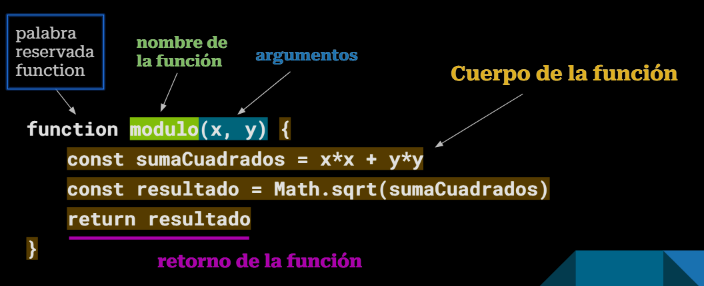
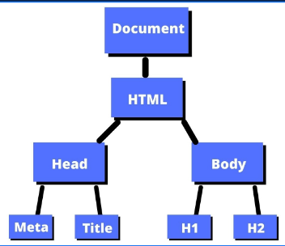

# JavaScript

## **¿Qué es JavaScript? ¿Para qué se usa?**

JavaScript es un **lenguaje de programación** *que se utiliza para añadir interactividad a las páginas web*. Permite crear animaciones, juegos, formularios dinámicos y mucho más. Es uno de los lenguajes de programación más populares del mundo y se utiliza en millones de sitios web.

A su vez, también es utilizado como lenguaje para el *backend*, a través de aplicaciones de servidor como por ejemplo *Node.js.*

## Antes de Arrancar!

- *Pueden utilizar ****Visual Studio Code**** para practicar con JavaScript, instalando Node.js y la extensión Code Runner. Otra opción es desde la consola de Chrome pulsando Ctrl+Shift+I*
- Nos basaremos en el estándar **EcmaScript 2015 (ES6)** para explicar el lenguaje
- El punto y coma (;) al final de cada instrucción es optativo. Usarlo o no queda a su criterio, pero sean consistentes con su elección.

## **Variables y Constantes**

==**const**== PI = 3.14159265359

==**let**== alumnosCursando = 237

PI = 3 —> **TypeError: Assignment to constant variable.**

alumnosCursando = 122 —> OK

## **Tipos de Datos**

*const *alumnos = **237	**		// **number**

*const *precio = **1392.50**		// **number**

*const *nombre = **“Bruno”**		// **string**

*const *esDomingo = **false**		// **boolean**

*const *persona = **{nombre: “pepe”, edad: 26}**		// **object**

*const *numeros = **[1, 2, 3]**						// **object**

*let *valorInicial = **null**							// **object**

*const *ultimoDigitoDePI = **undefined                              **// **undefined**

No hace falta definir el tipo de dato, se define solo.

## Estructuras de Control

```javascript
let numero = 8

if (numero < 20) {
    console.log("El número es menor a 20")
} else if (numero == 20) {
    console.log("El número es igual a 20")
} else {
    console.log("El número es mayor a 20")
}

while (numero < 20) {
    numero++  // numero = numero + 1
}

for (let i=1; i<5; i++) {
    const nuevoValor = numero + i
    console.log("Ahora el número vale: " + nuevoValor)
}
```

```javascript
const color = "red"

switch(color) {
    case "red": {
        console.log("El color es rojo")
        break
    }
    case "blue": {
        console.log("El color es azul")
        break
    }
    case "yellow": {
        console.log("El color es amarillo")
        break
    }
    default: {
        console.log("El color no existe")
    }    
}
```

## Keywords

Las keywords o **palabras reservadas** son palabras que no se pueden usar para nombrar variables ya que son especiales para el compilador de JavaScript.

Ejemplos: const, let, var, number, string, object, null, undefined, function, if, else, true, false, return, for, break, continue, while, switch, this, in, length, document

Lista completa: [https://www.w3schools.com/js/js_reserved.asp](https://www.w3schools.com/js/js_reserved.asp)

## Funciones



### Funciones como Tipo de Dato

```javascript
const modulo = function(x, y) {
    return Math.sqrt(x*x + y*y)
}

// Función flecha o "arrow function"
// (args) => returnValue
const suma = (x, y) => x + y

console.log(typeof suma)  // function
console.log(typeof modulo)  // function
console.log(suma(2, 3))  // 5
console.log(modulo(4, 6).toFixed(2)) 
```

En JavaScript, las funciones son ***first-class citizen***, es decir, se pueden manipular como valores (como si fuera un string, por ejemplo)

```javascript
const numeros = [1, 2, 3, 4, 5, 6]
const filtrados = numeros.filter(x => x % 2 == 0)

console.log(filtrados)  // resultado: [2, 4, 6]
```

En este ejemplo, estamos pasando una función para saber si un número es par como valor (por parámetro) al método filter, quien internamente la va a llamar para filtrar los números de nuestra lista.

### Funciones como Argumento

Las funciones también pueden formar parte del argumento de otra función.

```javascript
function student(){
    return "Alumno";
}
function greet(user){
    console.log("Bienvenido", user());    
}
// Prints "Welcome Teacher"
let message = greet(student);
```

### Funciones Resultado de otra Funcion

Las funciones también pueden ser devueltas en el “return” por otra función.

```javascript
let greet = function (valor) {
    return function () {
        console.log("Bienvenidos a nuestra materia!",valor);
    }
}
greet("Juan")();
```

## Bonus Track: API Request

```javascript
const pokemonURL = "https://pokeapi.co/api/v2/pokemon?limit=3&offset=0"

fetch(pokemonURL)
    .then(response => response.json())
    .then(json => console.log(json))
```

```bash
{
  count: 1302,
  next: 'https://pokeapi.co/api/v2/pokemon?offset=3&limit=3',
  previous: null,
  results: [
    { name: 'bulbasaur', url: 'https://pokeapi.co/api/v2/pokemon/1/' },
    { name: 'ivysaur', url: 'https://pokeapi.co/api/v2/pokemon/2/' },
    { name: 'venusaur', url: 'https://pokeapi.co/api/v2/pokemon/3/' }
  ]
}
```

# Integracion con HTML y CSS

## **DOM**: modificando nuestra página Web desde JavaScript

<!-- Column 1 -->
El **DOM *****(Document Object Model)**** *es una interfaz de programación para representar elementos HTML como objetos en JavaScript. Permite la manipulación de nuestra página Web a través del código.

<!-- Column 2 -->


## **¿Cómo se usa el DOM?**

Ejemplo: obtener el contenido del segundo párrafo

HTML:

**	<p>Hola mundo!</p>**

En JavaScript:

**			const parrafos = document.getElementsByTagName("p")**

**			const textoParrafo2 = parrafos[1].innerText**

**			console.log(textoParrafo2)**

## **¿Qué se puede hacer en el DOM con Javascript?**

- Puede cambiar todos los elementos HTML en la página
- Puede cambiar todos los atributos HTML en la página
- Puede cambiar todos los estilos CSS en la página
- Puede eliminar elementos y atributos HTML existentes
- Puede agregar nuevos elementos y atributos HTML
- Puede reaccionar a todos los eventos HTML existentes en la página
- Puede crear nuevos eventos HTML en la página

## Algunas funciones y props. básicas del DOM

- ***document***.getElementsByTagName(*...*)
- ***document***.getElementById(*...*)
- ***document***.getElementsByClassName(*...*)
- ***document***.createElement(...)
- ***document.body***
- elemento.append(...)
- elemento.appendChild(...)
- elemento.innerText
- elemento.innerHTML
- elemento.style
- elemento.parentElement
[https://www.w3schools.com/js/js_htmldom.asp](https://www.w3schools.com/js/js_htmldom.asp)

# **Eventos**

## **Nuestra Página Responde a Acciones del Usuario**

¿Qué pasa si hago click en un botón? ¿Cómo responde nuestra página ante este suceso? Esta situación es lo que se conoce como un **evento**.

Para definir la respuesta a un determinado evento de nuestra página Web necesitamos:

## **Escuchando un evento**

Ejemplo: mostrar una alerta cada vez que se haga click en un **botón**

HTML:

JavaScript:

**(Otra forma de resolverlo)**

HTML:

JavaScript:

# **Importando Scripts en Nuestra Página Web**

Existen 2 formas de importar código JavaScript a nuestro documento HTML:

La etiqueta **<script> **se coloca al final del *body.*

# Ejemplos

## Basico

```javascript
const title = document.getElementById("titulo")

title.addEventListener("mouseover", () => {
    alert("Hola")
})

const changeColor = document.getElementById("change-color")

changeColor.onclick = function (event) {
    const R = randomNumber().toString()
    const G = randomNumber().toString()
    const B = randomNumber().toString()
    title.style.color = `rgb(${R},${G},${B})`
}

function randomNumber() {
    return (Math.random() * 256).toFixed(0)
}

```

## Con Flask

### Seguimos con el ejercicio de Flask de la clase anterior

Pero ahora vamos a darle **funcionalidad **a nuestra página…

# Ejercitacion

## Ejercicio

Crear una página Web que contenga 2 campos de texto y un botón. El botón debe ser rojo con letra blanca. Al pulsar dicho botón se deberá mostrar una alerta por pantalla que muestre la concatenación de las cadenas que se ingresen en los campos de texto.

(No hace falta usar Flask)

# Sobre el TP

Si queremos, pasar el codigo css inline de un archivo html, podemos crear clases y copiar el style en el archivo css, y borrarlo del html dejando solo la clase.

En el punto de cambiar colores con css, buscamos en el html la clase y la buscamos en css y lo cambiamos.

En el punto 1, del script de bash, verificar que se tenga pip, y si no esta instalado instalarlo, si esta instalado crear el entorno.

# Jinja Bloques
