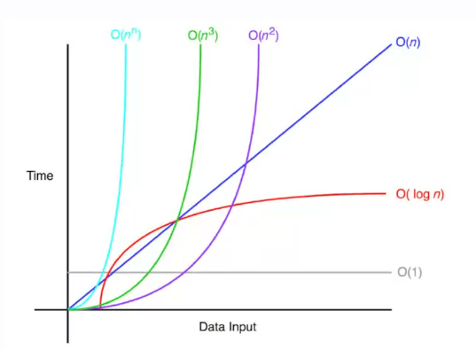

# Comparando Algoritmos

Para poder hacerlo tratamos de definir un *Modelo Matematico* para poder dejar de lado las limitaciones de cada dispositivo y en cuanto a procesamiento, memoria, etc.

## Vamos a Contar Instrucciones

- Cada sentencia simple es una instruccion (hasta el ;)
- Cada instruccion requiere 

### Recordar

- No medimos tiempos, usamos unidades abstractas
- Tenemos una estimacion que solo nos sirve para comparar.
- La cantidad de instrucciones depende del tamaño del problema.
- Podriamos comparar otro tipo de recursos ademas del tiempo. (como por ejemplo la memoria “cuantos bloques de memoria necesito”);
- Por si solo este modelo no es muy util.

# Notacion Big O

## Expresa una cota del tiempo de ejecucion

- Comportamiento del algoritmo dado el tamaño del problema
- Puede ser una cota superior (big O) o una cota inferior (big omega).
- Puede ser simultaneamente cota superior e inferior (big o tachada)

n: es el tamaño del problema

T: es la funcion.

c * f(n): es la cota que estoy buscando

$T(n) = O(f(n))$ si existe una constante posistiva c y un $n_0$ tal que $T(n) ≤ c * f(n)$, donde $n ≥ n_0$.

