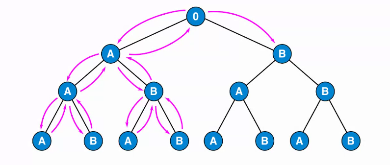

# Lista

# Recursividad

## Recursividad de Cola

Si la llamada recursiva a si misma es la ultima operación dentro de dicha función.

No hace falta operar con el resultado que recibe de la siguiente llamada recursiva

Nos permite optimizar las llamadas recursivas, para poder reducir el espacio ocupado en el *stack frame.*

# Dualidad

Cualquier cosa escrita de manera Iterativa puede ser escrita Recusivamente y viceversa.

Incluso existen lenguajes que no tienen estructuras iterativas, y son forzados a implementar la recursion.

## Backtracking

La idea es que yo tengo un problema y lo puedo expresar en forma/función de las distintas soluciones posibles que tengo.

*“Es una técnica de reso*

### *Problema Genérico*

Tengo un punto inicial y puede elegir entre dos opciones y así sucesivamente.

Trato de representar todos los estados posibles de mi problema.

Y si tengo una forma de hacerlo, puedo decir que la solución a mi problema va a estar en uno de esos estados / casos.

Lo que hago es entonces es recorrer cada uno de esos estados. Esto lo hago con invocaciones recursivas.

Empiezo a recorrer por ejemplo con A → A → A, si no encuentro la solución, hago un paso hacia atrás y puedo ir a B, quedaría A→ A→B.

Fijándome si puedo tomar otro camino, y si puedo exploro ese camino.

Mas adelante vamos a ver que se conoce como **DFS “Distributes FIle System”.** Busco en profundidad y no a lo ancho.
