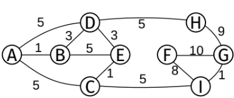

1. Explique qué es el Teorema Maestro, sus condiciones de aplicación, para qué se utiliza y de un ejemplo de uso.
	Explique por qué el Teorema no puede aplicarse al algoritmo QuickSort directamente y muestre bajo qué condiciones sí puede aplicarse (y cuál es el resultado de hacerlo).

2. Explique para qué sirve y cómo funcionan el algoritmo de Dijkstra.
	Muestre cómo se aplica paso a paso al siguiente grafo desde A.
	

3. Explique qué es un árbol Rojo/Negro y enumere las propiedades que debe cumplir.
	Justifique si cada uno de los siguientes árboles son Rojo/Negro válidos.
	

4. Explique cómo funciona el algoritmo de Floyd-Warshall, qué condiciones debe cumplir el grafo para poder ser aplicado y qué información nos da. 
	Implemente el algoritmo en C99. 
	Utilice la representación de grafo que mas le convenga (explicando cuál es).
	Muestre el resultado de aplicar el algoritmo al grafo del punto 3 pero incluyendo solamente los vérticas F, G, H e I (y las aristas que los unen).

5. Dada una tabla de hash cerrada de capacidad inicial 4 y función de hashing F(k)=3k-1; dibuje el estado de la tabla luego de insertar(+) y eliminar(-) cada uno de los siguientes pares en el orden dado: +<A;3>, +<D;6>, +<G;9>, +<J;3>, +<M;1>, -<B>, -<G>, -<A>, +<D;1>. 
	Explique las decisiones tomadas.