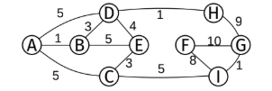

1. Escriba (en C99) una función recursiva de un parámetro (sin utilizar for, while, etc) que dado un string devuelva el último carácter repetido del mismo (por ejemplo en la palabra "PAPA" la última letra repetida es la "A").
	Explique la complejidad de la solución.
	Luego escriba otro algoritmo (no necesariamente recursivo) que tenga una complejidad menor que la anterior solución.
	Justifique.

2. Explique cómo funciona Merge-sort.
	Muestre un esquema de su funcionamiento.
	Justifique la complejidad del algoritmo y demuestre por qué no cambia si el algoritmo divide el vector en 2, 3, 4 o n partes.
	Aplique el algoritmo al vector V=[8,4,2,6,3,9,0,1] para ordenarlo de menor a mayor.

3. Explique para qué sirve y cómo funcionan el algoritmo de Dijkstra.
	Muestre cómo se aplica paso a paso al siguiente grafo desde F.
	

4. Explique (con diagramas) qué es una matriz de adyacencia y una lista de adyacencias.
	Explique si es posible representar la misma información o existe alguna limitación con alguna de estas representaciones.
	Escriba (en C99) una función que reciba una matriz de adyacencias de un  grafo pesado y devuelva una lista de adyacencias.
	Justifique la complejidad de la solución. Para este ejercicio se puede suponer que las operaciones de memoria no fallan.

5. Dada una tabla de hash cerrada de capacidad inicial 4 y función de hashing F(k)=2 x k-5; dibuje el estado de la tabla luego de insertar(+) y eliminar(-) cada uno de los siguientes pares en el orden dado: +<B;2>, +<C;1>, +<A;8>, +<J;3>, -<M>, -<B>, -<A>, +<J;1>, +<A;8> (siendo A=0, B=1, etc). Explique las decisiones tomadas.