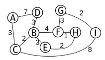

1. Escriba una función (en C99 o Python) como parte de la implementación de un árbol AVL que reciba un nodo y un tipo de rotación y la realice.
	Agregue parámetros si cree que son necesarios.
	Justifique la implementación, su complejidad y explique cómo funciona.

2. Explique el algoritmo de heap-sort. Utilizando heap-sort ordene el siguiente vector de menor a mayor.
	Justifique la complejidad y muestre cada paso del algoritmo. V = [6, 8, 2, 4, 5, 1, 0, 9].

3. Explique qué es el algoritmo de Dijkstra y para qué sirve.
	Aplíquelo al siguiente grafo mostrando el resultado de cada paso y el resultado final comenzando desde H.
	

4. Explique qué es un grafo bipartito.
	Determine si el grafo del punto 3 es bipartito.
	Escriba (en C99 o Python) un algoritmo para detectar si un grafo es bipartito.
	Explique cómo funciona y las estructuras de datos necesarias para su funcionamiento. 

5. Explique qué es un diccionario y para qué se utiliza.
	Haga una tabla comparativa con 3 implementaciones diferentes (tabla de hash es una sola) de diccionarios.
	Las tabla debe poseer las siguientes columnas (como mínimo): Tiempo de inserción y búsqueda, resolución de colisiones, memoria (aproximado en bytes) utilizada en función a la cantidad de claves.
	Para cada casillero explique cómo llega a la respuesta.