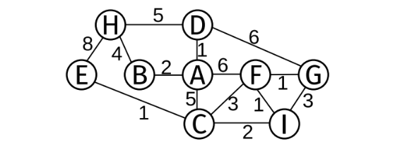
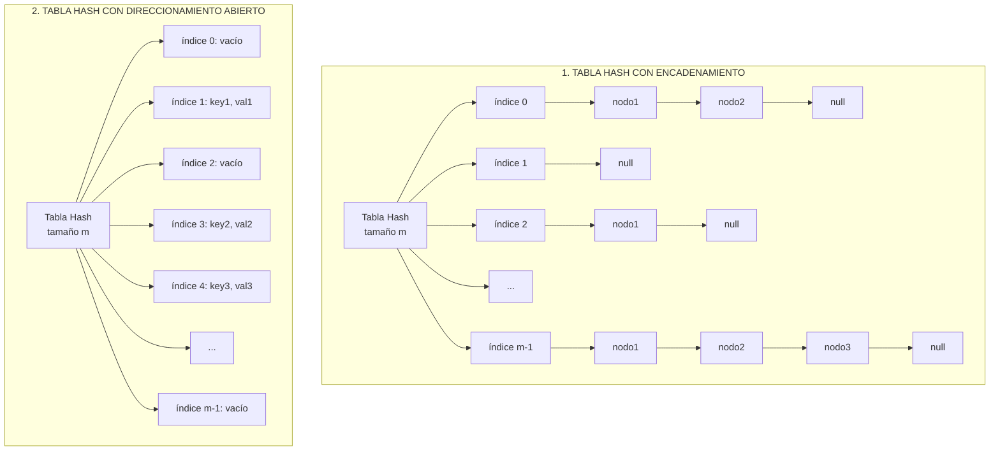
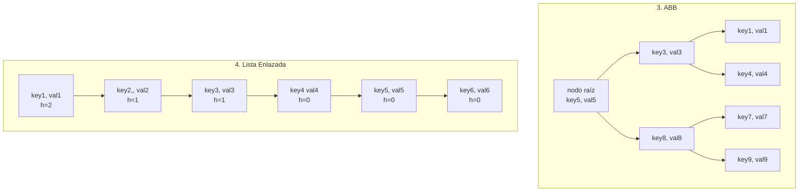

# Final 3 - 1C 2025

## Ejercicio 1

Escriba una función (en C99 o Python) un algoritmo que dado un vector de strings, encuentre el primer string repetido en tiempo lineal. Justifique.

```python
def encontrar_primer_repetido(strings):
	visitados = set()

	for string in strings:
		if string in visitados:
			return string
		visitados.add(string)

	return None
```

## Ejercicio 2

Explique qué es un árbol Rojo/Negro y enumere las propiedades que debe cumplir. Justifique si cada uno de los siguientes árboles son Rojo/Negro válidos.  


Un Arbol Rojo Negro es un tipo de Arbol Binario de Busqueda Autobalanceado, caracterizado por establecer en cada nodo del Arbol un color, lo cual permite establecer una serie de condiciones que deben cumplir los nodos del Arbol en relacion con estos colores asignados para poder asegurar el balanceo del mismo.  
La idea es que para cualquier recorrido/camino realizado en el arbol hasta las hojas tendremos la misma cantidad de nodos **negros**.

1. La raiz del arbol debe ser de color negro.
2. Se insertan siempre nodos rojos, y luego se rebalancea el arbol.
3. No hay nodos rojos adyacentes. Siempre un nodo rojo tiene como hijos y padre nodos de color negro.

## Ejercicio 3

Explique qué es un arbol de tendido mínimo y para qué sirve. Explique un algoritmo posible para obtener dicho árbol y aplíquelo al siguiente grafo mostrando el paso a paso:  


Un Arbol de Tendido Minimo es considerado a aquel Arbol obtenido a partir de un grafo, el cual posee en su totalidad el menor tamaño posible en relacion con el peso de sus posibles aristas.

Un posible Algoritmo es el Algoritmo de Prim, el cual se encarga de a partir de un vertice inicial, ir incorporando aristas y vertices del Grafo al Arbol, hasta haber incorporando todos los vertices del Arbol.

El criterio de incorporacion de aristas se basa en:

- El vertice no debe pertenecer al Arbol.
- La arista debe ser la de menor peso.
- No debe formarse un ciclo

## Ejercicio 4

Escriba (en C99 o Python) un algoritmo que dado un digrafo obtenga un orden topológico.  
Explique qué significa, cómo funciona el algoritmo y si la solución encontrada es única.  
Muestre un ejemplo de aplicación.

Dependiendo si el algoritmo toma un vertice de inicio o proporcionado por el usuario, el orden topologico resultante puede variar.  
De modo que, si el vertice lo determina el algoritmo como por ejemplo el primer indice como vertice de una lista de adyacencias, siempre va a dar para el mismo grafo el mismo orden topologico.  
En cambio si el vertice de inicio es aleatorio, pueden llegar a darse distintos ordenes resultantes.

Un posible algoritmo es uno similar al DFS, pero incorporando los vertices luego de avanzar lo maximo posible sobre los vertices.
Luego invierto la lista resultante.

```python
def orden_topologico(grafo, vertice):
	topologico = []

	def orden_topologico_recursivo(grafo, vertice, topologico):
		for adyacente in grafo[vertice]:
			if adyacente not in topologico:
				orden_topologico_recursivo(grafo, adyacente, topologico)
			if vertice not in topologico:
				topologico.append(vertice)
			
	orden_topologico_recursivo(grafo, vertice, topologico)

	return topologico.reverse()
```

## Ejercicio 5

Explique utilizando diagramas 4 formas de implementar diccionarios. Explique las diferencias de funcionamiento de cada una y especifique la complejidad de las operaciones de inserción, eliminación y búsqueda de cada variante. Justifique.




