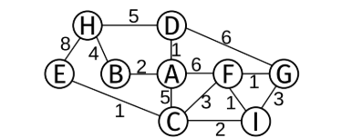
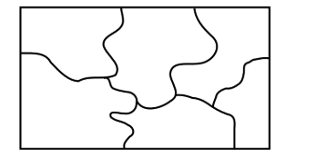

1. Escriba una función (en C99 o Python) un algoritmo del tipo divide y conquista que encuentre simultáneamente el mayor y menor elemento de un vector de enteros.
	Explique cómo funciona.
	Calcule la complejidad computacional del algoritmo (justificando de dónde sale el resultado).

2. Explique cómo funciona Merge Sort.
	Aplique el algoritmo para ordenar de mayor a menor el siguiente vector: V = [6,3,8,0,1,2,5,4].
	Muestre cada paso del algoritmo y justifique la complejidad.
	Justifique cuál sería el efecto de modificar Merge Sort para que sea in-place.

3. Explique para qué sirve y cómo funcionan el algoritmo de Kruskal y de Prim.
	Muestre cómo se aplica uno de los dos algoritmos paso a paso al grafo de la figura.
	Justifique si es posible (en general) encontrar una solución diferente aplicando el otro algoritmo.
	

4. Escriba (en C99 o Python) una función que dado un mapa como el de la figura, sea capaz de colorear cada sector del mapa utilizando 4 colores diferentes de forma tal que nunca dos colores iguales se toquen entre si.
	En caso de ser imposible la función debe retornar error.
	Diseñe las estructuras que crea necesarias y explique para qué sirven.
	Explique cómo funciona el el algoritmo (muestre uno o mas ejemplos).
	

5. Explique qué es un diccionario y cómo difiere de una tabla de hash.
	Escriba en (C99 o Python) el código para insertar un elemento en una tabla de hash abierta.
	Explique los puntos importantes de esta función y cómo funciona.