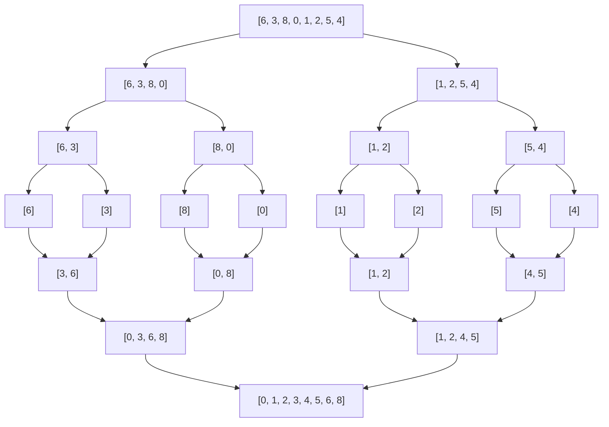

# Final 5 - 1C 2025

## Ejercicio  1

Escriba una función (en C99 o Python) un algoritmo del tipo divide y conquista que encuentre simultáneamente el mayor y menor elemento de un vector de enteros.  
Explique cómo funciona.  
Calcule la complejidad computacional del algoritmo (justificando de dónde sale el resultado).

```c
void evaluar_mayor_menor(int *v1, size_t tam_1, int *v2, size_t tam_2, int *mayor, int *menor)
{
	int i;
	for (i = 0; i < tam_1; i++) {
		if (v1[i] > *mayor)
			*mayor = v1[i];
		if (v1[i] < *menor)
			*menor = v1[i];
	}

	for (i = 0; i < tam_2; i++) {
		if (v2[i] > *mayor)
			*mayor = v2[i];
		if (v2[i] < *menor)
			*menor = v2[i];
	}
}

void encontrar_mayor_menor_recursivo(int *vector, size_t tamaño, int *mayor, int *menor)
{
	if (tamaño <= 1)
		return;

	size_t mitad = tamaño / 2;

	encontrar_mayor_menor_recursivo(vector, mitad, mayor, menor);
	encontrar_mayor_menor_recursivo(vector + mitad, tamaño - mitad, mayor, menor);

	evaluar_mayor_menor(vector, mitad, vector + mitad, tamaño - mitad, mayor, menor);
}

void encontrar_mayor_menor(int *vector, size_t tamaño, int *mayor, int *menor)
{
	if (vector == NULL || mayor == NULL || menor == NULL)
		return;
	*mayor = vector[0];
	*menor = vector[0];

	encontrar_mayor_menor_recursivo(vector, tamaño, mayor, menor);
}
```

## Ejercicio 2 

Explique cómo funciona Merge Sort.  
Aplique el algoritmo para ordenar de mayor a menor el siguiente vector: V = [6,3,8,0,1,2,5,4].  
Muestre cada paso del algoritmo y justifique la complejidad.  
Justifique cuál sería el efecto de modificar Merge Sort para que sea in-place.

Merge Sort es un Algoritmo de Ordenamiento el cual funciona dividiendo el vector a ordenar en dos partes iguales de manera sucesiva, y luego realizar la combinacion de las partes analizando el orden que deben tomar para poder ordenarlo.  



## Ejercicio 3

Explique para qué sirve y cómo funcionan el algoritmo de Kruskal y de Prim.  
Muestre cómo se aplica uno de los dos algoritmos paso a paso al grafo de la figura.  
Justifique si es posible (en general) encontrar una solución diferente aplicando el otro algoritmo.  


Los Algoritmos de **Prim** y **Kruskal** son dos algoritmos que nos permiten hayar Arboles de Tendido Minimo a partir de grafos.  
**Prim** funciona a partir de un vertice de inicio, y va incorporando los adyacentes y aumentando el tamaño del Arbol, siempre por las aristas de menor peso, y evitando que se formen bucles.  
**Kruskal** funciona a ordenando las aristas de menor a mayor peso e ir formando componentes conexas con los vertices. Si una arista relaciona dos componentes conexas se incorpora al Arbol.  

## Ejercicio 4

Escriba (en C99 o Python) una función que dado un mapa como el de la figura, sea capaz de colorear cada sector del mapa utilizando 4 colores diferentes de forma tal que nunca dos colores iguales se toquen entre si.  
En caso de ser imposible la función debe retornar error.  
Diseñe las estructuras que crea necesarias y explique para qué sirven.  
Explique cómo funciona el algoritmo (muestre uno o mas ejemplos).  


```python
def obtener_colores_usados(grafo, vertice, coloreados):
	usados = []

	for adyacente in grafo[vertice]:
		if adyacente in coloreados:
			usados.append(coloreados[adyacente])

	return usados

def colorear_recursivo(grafo, vertice, coloreados):
	if vertice in coloreados:
		return True

	colores_usados = obtener_colores_usados(grafo, vertice, coloreados)
	
	color = 0
	color_asignado = None
	while color < 4 and color_asignado == None:
		if color not in colores_usados:
			color_asignado = color
		color += 1
	if color_asignado == None:
		return False

	coloreados[vertice] = color_asignado
	for adyacente in grafo[vertice]:
		if adyacente not in coloreados:
			if colorear_recursivo(grafo, adyacente, coloreados) == False:
				return False
	
	return True

def colorear(grafo):
	coloreados = {}
	inicio = list(grafo.keys())[0]

	resultado = colorear_recursivo(grafo, inicio, coloreados)
	if resultado == True:
		return coloreados
	return False
```

Al ser mas de 2 colores (como en el de los bipartito), tenemos que en cada paso verificar todos los posibles colores, antes de asignar o tomar una decision de si es posible o no colorearlo.  
Entonces usamos una funcion que revisa los colores adyacentes y los guarda en una lista, y luego se evalua color por color si es posible asignarle algun color al vertice actual.  

## Ejercicio 5

Explique qué es un diccionario y cómo difiere de una tabla de hash.  
Escriba en (C99 o Python) el código para insertar un elemento en una tabla de hash abierta.  
Explique los puntos importantes de esta función y cómo funciona.

Un Diccionario es un Tipo de Dato Abstracto (TDA), el cual nos permite almacenar informacion, de manera que tendremos `valores` que almacenar con `claves` asociadas a estos valores, que nos permiten identificarlos de manera unica.  
Una Tabla de Hash es una forma de implementacion de este TDA Diccionario, el cual nos brinda 2 formas de almacenar los elementos (Tabla de Hash Abierta y Cerrada), y una forma de acceder a los valores almacenados de manera eficiente mediante la transformacion de las claves en un valor asociado correspondido dentro de la tabla lo cual llamamos *"Hasheo"* y lo hacemos a traves de *"funciones de Hash"*.  
