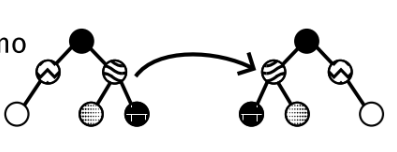

# Final 4 - 1C 2025

## Ejercicio 1

Escriba una función (en C99 o Python) como parte de la implementación de un árbol binario que invierta el arbol.  
Explique cómo es la estructura del árbol y cómo funciona el algoritmo utilizando gráficos.  
Muestre un ejemplo del funcionamiento.  
Justifique la complejidad.  


```c
typedef struct nodo {
	nodo_t *izq;
	nodo_t *der;
	void *valor;
} nodo_t;

typedef struct arbol {
	nodo_t *raiz;
	size_t cantidad;
} arbol_t;

void invertir_arbol_recursivo(nodo_t *nodo)
{
	if (nodo == NULL)
		return;

	invertir_arbol_recursivo(nodo->izq);
	invertir_arbol_recursivo(nodo->der);

	nodo_t *aux = nodo->izq;
	nodo->izq = nodo->der;
	nodo->der = aux;
}

void invertir_arbol(arbol_t *arbol)
{
	if (arbol == NULL || arbol->raiz == NULL)
		return;

	invertir_arbol_recursivo(arbol->raiz);
}
```

## Ejercicio 2

Explique qué es un heap binario y qué operaciones admite.  
Utilice Heapsort para ordenar de mayor a menor (in-place) el siguiente vector: V = [6,3,8,0,1,2,5,4].  
Muestre cada paso del algoritmo.  
Justifique cuál sería la diferencia metodológica en caso de un Heapsort que no sea in-place.

Un Heap Binario es un tipo de Arbol Binario que se caracteriza por establecer un orden por niveles del arbol.  
El mismo se completa de izquierda a derecha y por niveles, no se agrega un nivel hasta que el nivel anterior este completo.  
Se caracteriza por establecer una jerarquia de pesos de los valores almacenados, en donde podemos decir que los elementos establecidos como de menor peso estaran en un nivel mayor que los de mayor peso que tienden a bajar.  
Las operaciones que permite son:  
- Sift Down: Esta operacion se encarga de evaluar si un nodo se encuentra posicionado correctamente en el Heap, comparandolo con sus hijos, y si es mas pesado lo ubica correctamente en el nivel inferior que le corresponde.
- Sift Up: Esta operacion se encarga de evaluar si un nodo se encuentra posicionado correctamente en el Heap, comparandolo con su padre, y si es mas liviano lo ubica correctamente en el nivel superior que le corresponde.
- Ver/Quitar Raiz.

## Ejercicio 3

Explique para qué sirve y cómo funcionan el algoritmo de Dijkstra.  
Muestre cómo se aplica paso a paso al siguiente grafo desde E:  


El Algoritmo de Dijkstra es un Algoritmo que aplica a Grafos Pesados, y nos permite encontrar a partir de un vertice inicial, todos los caminos minimos al resto de vertices del grafo.  
Funciona partiendo de un vertice inicial, y se establecen como listas, los vertices Visitados del grafo y los NO Visitados aun.  
Luego en una tabla de completa con los vertices del grafo, las distancias minimas, y el vertice anterior por el que se llego a ese vertice.  
- Completamos la tabla con el vertice inicial, y los adyacentes conocidos del vertice, el resto de las distancias son marcadas como infinito.
- Se marca el vertice como visitado.
- Se visita el vertice de menor distancia conocida.
- Se calculan la distancias con sus adyacentes como la suma entre su distancia mas la de la arista.
- Si el resultado es menor al de la tabla se actualiza.
- Se repite hasta haber vaciado la lista de NO Visitados, o completado la lista de Visitados.

## Ejercicio 4

Para el grafo del punto anterior, encuentre la cantidad mínima de aristas a recorrer desde E al resto de los vértices (sin impotar su peso).  
Escriba (en C99 o Python) un algoritmo que dado cualquier grafo y un vértice del mismo, pueda determinar esta métrica.  
Justifique la solución y explique cómo funciona.  

Una algoritmo posible para encontrar la cantidad minima de aristas a recorrer desde un vertice dado, seria utilizar un algoritmo similar a BFS, e ir almacenando en un diccionario el vertice y la cantidad de aristas hasta el.

```python
def obtener_cantidad_minima(grafo, inicio):
	visitados = []
	orden = {}
	cola = []
	cola.append(inicio)
	visitados.append(inicio)
	orden[inicio] = 0

	while len(cola) > 0:
		visitado = cola.pop(0)
		for adyacente in grafo[visitados]:
			if adyacente not in visitados:
				orden[adyacente] = orden[visitado] + 1
				cola.append(adyacente)
				visitados.append(adyacente)

	return orden
```

## Ejercicio 5

Explique utilizando diagramas 3 formas diferentes de almacenar grafos.  
Explique ventajas y desventajas de cada uno y armar una tabla comparativa con la complejidad de agregar/quitar nodos/ aristas.  
Compare también la complejidad espacial de cada forma.  

**Matriz de Adyacencias**: almacena tanto en columnas como en filas los vertices del grafo, y en sus valores los pesos de las aristas que los relacionan. Si el grafo es no pesado se coloca un 1. Busca representar las adyacencias entre los vertices, por lo que si el valor almacenado es distintos de cero significa que los vertices fila columna, son adyacentes.

**Matriz de Incidencias**: almacena como columnas vertice y como fila las distintas aristas, y los valores corresponden con que vertice se corresponde con cada arista, busca representar las aristas incidentes para cada vertice, por lo que podemos identificar que vertice se relaciona con que arista de mnera sencilla.

**Lista de Adyacencias**: almacena cada vertice, y para cada uno de los mismos una lista con los vertices adyacentes.

|   Representacion   |                      Complejidad Agregar                      |     Complejidad Quitar      | Espacial |
|:------------------:|:-------------------------------------------------------------:|:---------------------------:|:--------:|
| Matriz Adyacencias | Nodo: *O(v^2)* (por el peor caso de realloc) Arista: *O(1)*   | Nodo: O(n) Arista: O(1)     | *O(v^2)* |
| Matriz Incidencias | Nodo: *O(v*e)* (por el peor caso de realloc) Arista: *O(v*e)* | Nodo: O(v*e) Arista: O(v*e) |  O(v*e)  |
| Lista Adyacencias  | Nodo: *O(1)*/*O(v) Arista: *O(1)*/*O(v)*			     		 | Nodo: O(n) Arista: O(1)	   |  O(v+e)  |
