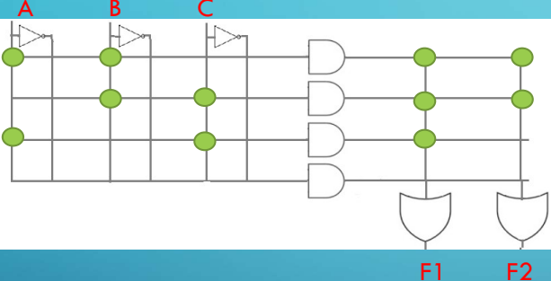

# Dispositivos Lógicos Programables

Dentros de los PLDs *(Programable Logic Devices) *podemos encontrar dos tipos:

- Simples
- Complejos

Particularmente nos vamos a sentrar en los simples.

## Simple PLD

- ***ROM***** - READ ONLY MEMORY**: Array de ANDs y ORs donde la matriz de AND ya viene pre-grabada y se utiliza un grabador de EPROM para el grabado de la matriz de OR.
- ***PAL***** – PROGRAMMABLE ARRAY LOGIC**: Array de ANDs y ORs donde la matriz de OR ya viene pre-grabada y se utiliza un grabador para el
grabado de la matriz de AND.
- ***PLA***** - PROGRAMMABLE LOGIC ARRAY**: Array de ANDs y ORs donde ambas matrices pueden ser grabadas.

### ROMS

- ***ROM***: es una memoria digital donde el valor de cada bit depende del estado de un fusible, que puede ser quemado una sola vez. Estas memorias son utilizadas para grabar datos permanentes.
- ***EPROM***: “*Erasable Programmable Read-Only Memory”*, es un tipo de memoria ROM no volátil. Se programan mediante un dispositivo que proporciona voltajes superiores a los normalmente utilizados en los circuitos electrónicos. Las celdas que reciben carga se leen entonces como un 1.
Una vez programada, una EPROM se puede borrar solamente mediante exposición a una fuerte luz ultravioleta. Los antiguos BIOS de las PCs eran frecuentemente EPROMs.
- ***EEPROM***: “*Electrically-Erasable Programmable Read-Only Memory”*; Es un tipo de memoria ROM que puede ser programada, borrada y reprogramada electricamente, a diferencia de la EPROM que ha de borrarse mediante un aparato que emite rayos ultravioletas.
La memoria flash es una forma avanzada de EEPROM.

<!-- Column 1 -->

<!-- Column 2 -->
La grabación de las Fi se realiza sobre la matriz de OR

- MX AND pre-grabada
- MX OR se graba con grabador de EPROM

Supongamos la necesidad de implementar dos funciones F1 y F2:

Para implementación con ROMs debemos hallar las funciones canónicas: (Capacidad 8 x 2)

$F1(ABC) = ABC + AB\bar{C} + ABC + \bar{A}BC + ABC + A\bar{B}C$

$F1(ABC) = ABC + AB\bar{C} + \bar{A}BC + A\bar{B}C = Sum_m(3,5,6,7)$

$F2(ABC) = ABC + AB\bar{C} + ABC + \bar{A}BC$

$F2(ABC) = ABC + AB\bar{C} + \bar{A}BC = Sum_m (3,6,7)$

### PAL (Prog. Array Logic)

<!-- Column 1 -->

<!-- Column 2 -->
Supongamos la necesidad de implementar dos funciones F1 y F2:

$F1(ABC) = AB+BC+AC$

$F2(ABC) = AB+BC$

Para implementación con PALs se utilizan las Fi mínimas.
Estas Fi dadas ya son mínimas.
*Capacidad* : 6 x 2

### PLA (Prog. Logic Array)

<!-- Column 1 -->

<!-- Column 2 -->
Supongamos la necesidad de implementar dos funciones F1 y F2:

$F1(ABC) = AB+BC+AC$

$F2(ABC) = AB+BC$

Para implementación con PLAs se utilizan las Fi mínimas.
Estas Fi dadas ya son mínimas.
*Capacidad necesaria*: 3 x 2

# PLD RESUMEN

- Implementación con ROM: se precisa disponer de la función canónica ya que la matriz de AND es un decodificador pre-grabado que entrega los mi. Luego se graba la matriz de OR.
- Implementación con PAL: se requiere función mínima. La matriz de OR está pre-grabada, se graba la función utilizando la matriz de AND.
- Implementación con PLA: idem anterior, pero ambas matrices son grabables.
- Capacidad de la memoria: MX AND X MX OR